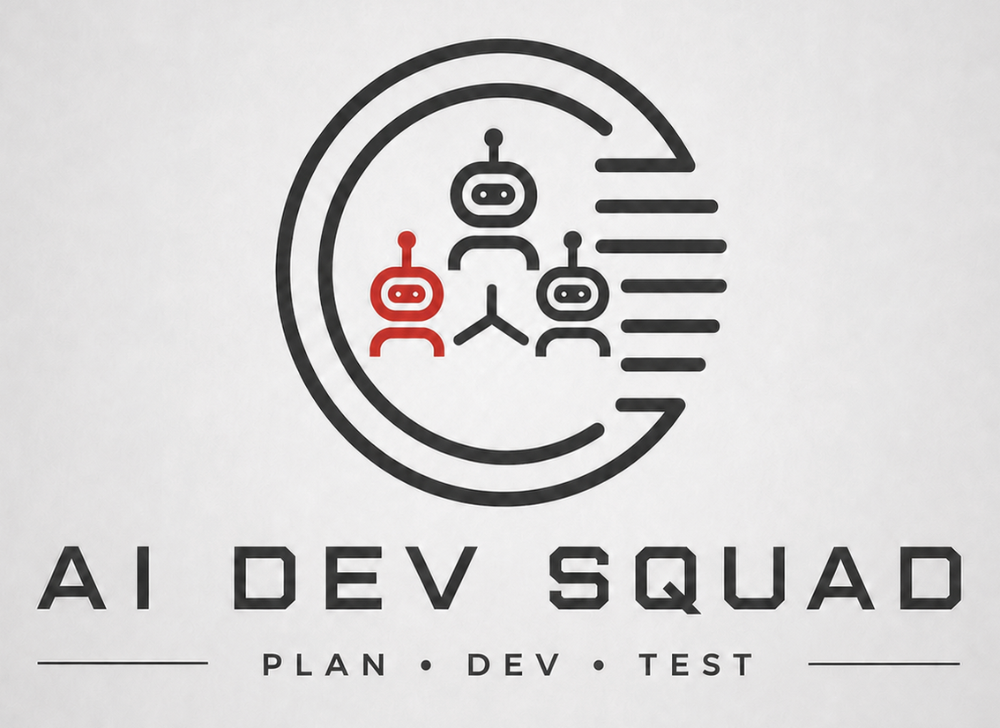

# AI Dev Squad

AI Dev Squad is a local-first Human-in-the-Loop AI coding system. (Alfa Version)

The project uses:
- **LangGraph** for the workflow and agent orchestration
- **Local tools** for coding and testing
- **Codex CLI** as the default coding provider
- **A local model provider placeholder** as the second provider for offline mode later
- **Streamlit** as the future chat UI, included but not active yet

## Goal

Build a small agent squad with three roles:

1. **Orchestrator Agent**
   - Understands the user task
   - Builds a simple execution plan
   - Decides whether the next step is approval, development, or testing

2. **Developer Agent**
   - Uses a coding provider to create or update code
   - Starts with **Codex CLI** as the default provider
   - Can later switch to a local model provider without changing the orchestration logic

3. **Tester Agent**
   - Runs local test commands
   - Returns a simple test summary and status

## Current scope

This repository contains a clean starter scaffold with:

- LangGraph workflow
- Agent classes
- Model router
- Codex provider wrapper
- Local provider placeholder
- Tool layer
- Streamlit UI
- Unit tests

## Architecture overview

```text
User / Future Chat UI
        |
        v
  Orchestrator Agent
        |
        v
   Approval Step
        |
        v
   Developer Agent ----> Model Router ----> Codex Provider (default)
        |                                  Local Provider (placeholder)
        v
   Tester Agent ----> Test Runner
        |
        v
     Final Result
```

## Project structure

```text
ai-dev-squad/
├── README.md
├── requirements.txt
├── .env.example
├── langgraph.json
├── app/
│   ├── __init__.py
│   ├── main.py
│   ├── config/
│   │   ├── __init__.py
│   │   ├── settings.py
│   │   └── logging_config.py
│   ├── agents/
│   │   ├── __init__.py
│   │   ├── orchestrator.py
│   │   ├── developer.py
│   │   └── tester.py
│   ├── graph/
│   │   ├── __init__.py
│   │   ├── state.py
│   │   ├── nodes.py
│   │   ├── edges.py
│   │   └── workflow.py
│   ├── models/
│   │   ├── __init__.py
│   │   ├── base_provider.py
│   │   ├── model_router.py
│   │   ├── codex_provider.py
│   │   └── local_provider.py
│   ├── tools/
│   │   ├── __init__.py
│   │   ├── codex_tool.py
│   │   ├── test_runner.py
│   │   ├── file_tool.py
│   │   └── approval_tool.py
│   ├── services/
│   │   ├── __init__.py
│   │   ├── task_service.py
│   │   └── execution_service.py
│   ├── prompts/
│   │   ├── orchestrator_prompt.txt
│   │   ├── developer_prompt.txt
│   │   └── tester_prompt.txt
│   └── ui/
│       ├── __init__.py
│       ├── streamlit_app.py
│       └── components.py
├── tests/
│   ├── __init__.py
│   ├── test_orchestrator.py
│   ├── test_developer.py
│   ├── test_tester.py
│   ├── test_model_router.py
│   └── test_workflow.py
├── docs/
│   ├── architecture.md
│   ├── flow.md
│   ├── folder-structure.md
│   └── roadmap.md
└── scripts/
    ├── run_local.py
    ├── run_streamlit.py
    └── demo_task.py
```

## Folder descriptions

### `app/`
Main application package.

### `app/config/`
Configuration and logging setup.

### `app/agents/`
Agent logic for Orchestrator, Developer, and Tester.

### `app/graph/`
LangGraph state, nodes, edge routing, and workflow creation.

### `app/models/`
Model provider interface, router, Codex provider, and local model placeholder.

### `app/tools/`
Low-level tool wrappers for approvals, file actions, Codex execution, and test execution.

### `app/services/`
Small helper services to keep the agent files clean.

### `app/prompts/`
Prompt templates. These are simple text files now, but they give you a clean place to keep agent instructions.

### `app/ui/`
Future Streamlit UI layer. It is included in the project, but not active yet.

### `tests/`
Unit tests for the main flow and components.

### `docs/`
Extra documentation for architecture, flow, roadmap, and folder descriptions.

### `scripts/`
Convenience scripts for local runs.

## How the model routing works

The Developer Agent never talks directly to a specific provider.  
Instead it calls the **Model Router**.

This keeps the design clean:

- `CodexProvider` is the default provider
- `LocalProvider` is the offline placeholder
- You can add new providers later without changing the graph flow

## Default provider

The default provider is **Codex**.

The Codex provider assumes:
- Codex CLI is installed
- You are already signed in
- The `codex` command is available on your machine

If not, the provider returns a safe error message instead of changing files.

## Local model placeholder

The project also includes a local provider placeholder.  
The code comments mention a future option such as:

- `qwen2.5-coder:7b` via Ollama

This provider is intentionally simple for now. It is here to make the switch easy later.

## Human-in-the-Loop

This project is designed with a hard approval gate:

- no development step without approval
- no test step without approval

For now the approval value is passed in state.  
Later the Streamlit UI can collect it from the user.

## Run locally

### 1. Open the project folder

```bash
cd ai-dev-squad
```

### 2. Create a virtual environment

```bash
python3 -m venv .venv
```

### 3. Activate the virtual environment

```bash
source .venv/bin/activate
```

### 4. Install packages

```bash
pip install -r requirements.txt
```

### 5. Copy the environment file

```bash
cp .env.example .env
```

### 6. Check Codex CLI login

```bash
codex login status
```

Expected result:

```text
Logged in using ChatGPT
```

### 7. Review the `.env` file

Example values:

```env
APP_ENV=local
APP_NAME=AI Dev Squad
DEFAULT_MODEL_PROVIDER=codex
CODEX_CLI_COMMAND=codex
LOCAL_MODEL_NAME=qwen2.5-coder:7b
DEFAULT_TEST_COMMAND=pytest -q
ENABLE_MOCK_TOOLS=false
```

### 8. Run the local workflow

```bash
python3 scripts/run_local.py
```

This will:
- build the workflow state
- run the Orchestrator
- run approval logic
- call the Developer Agent
- call the Tester Agent
- print the result in the console

### 9. Run tests for the project

```bash
pytest
```

## Run with LangGraph Studio

### 1. Install LangGraph CLI

```bash
pip install -U "langgraph-cli[inmem]"
```

### 2. Add LangSmith settings to `.env`

```env
LANGSMITH_API_KEY=your_pat_token_here
LANGSMITH_TRACING=true
```

If preferred, tracing can also be turned off:

```env
LANGSMITH_TRACING=false
```

### 3. Check `langgraph.json`

Example:

```json
{
  "dependencies": ["."],
  "graphs": {
    "agent": "./app/graph/workflow.py:graph"
  },
  "env": ".env"
}
```

### 4. Start the local LangGraph server

```bash
langgraph dev
```

Expected output includes:
- local API URL
- Studio UI URL
- API docs URL

### 5. Open Studio

Open the Studio URL shown in the terminal, for example:

```text
https://smith.langchain.com/studio/?baseUrl=http://127.0.0.1:2024
```

### 6. Inspect the workflow

In Studio you can:
- view the graph
- run the flow
- inspect node state
- inspect messages
- inspect approval status
- inspect development and test results

## Streamlit UI

The Streamlit UI files are included but not active yet.

When you want to explore them later:

```bash
streamlit run app/ui/streamlit_app.py
```

## Notes

- This scaffold is intentionally simple
- Real Codex use depends on local CLI setup
- The local model path is a placeholder for the next phase
- LangGraph Studio is useful for graph debugging and state inspection
- Streamlit will be better later for the real user-facing approval flow

## Next steps

1. Add real approval capture from Streamlit
2. Improve task-aware test logic
3. Add richer result and history tracking
4. Add a real local model provider
5. Add ChatGPT + MCP integration later
This repository is under active development, and the docs will continue to evolve with each iteration.
