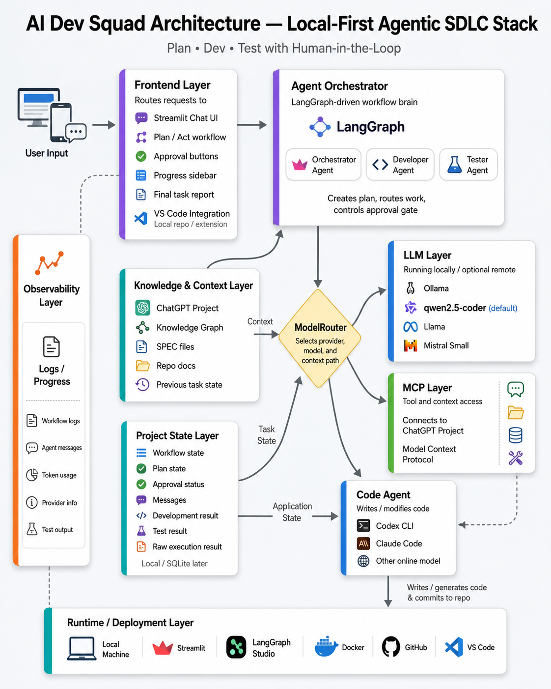
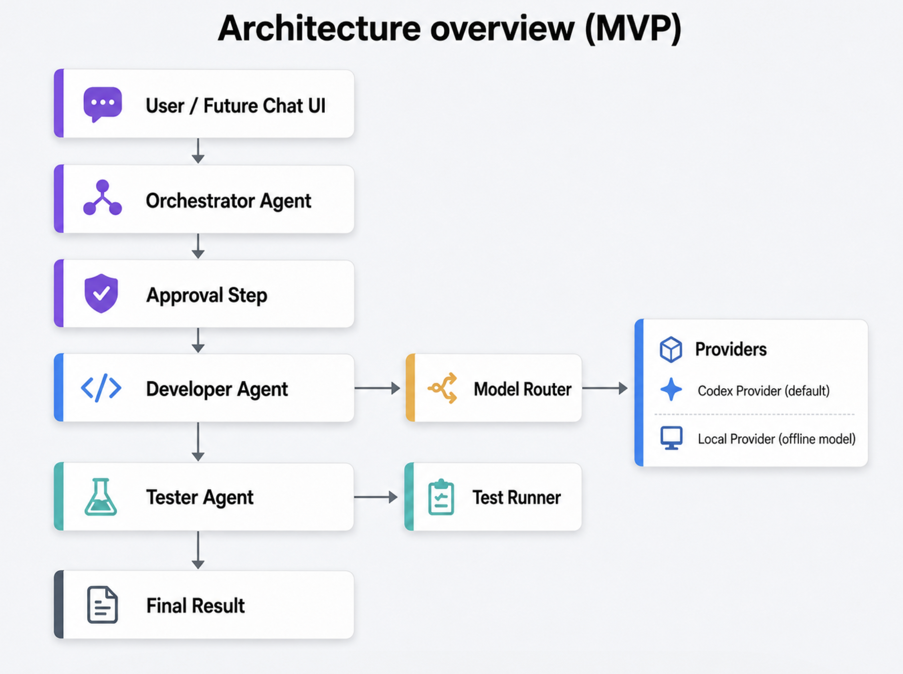

# AI Dev Squad

AI Dev Squad is a local-first agentic development system with Human-in-the-Loop control.

The goal is simple:
use AI to help plan, write, and test code, while keeping people in control of what happens and when it happens.

## Why this project exists

Most AI coding tools are tied to one vendor, one model, or one workflow.  
That makes it harder to switch providers, keep context, control changes, and build our own process.

AI Dev Squad is built to solve that.

With this project, we can:
- choose the model
- switch between providers
- keep project context
- control when agents are allowed to act
- add approval before code changes happen

## Project Vision

AI Dev Squad is a local-first agentic development system where we stay in control.  
We can choose the model, switch between AI providers, keep project context, and decide when agents are allowed to act.

## Project Stack



The project uses:
- **LangGraph** for workflow and orchestration
- **Codex CLI** as the default coding provider
- **Ollama** for the local/offline provider
- **Streamlit** for the user-facing chat UI
- **LangGraph Studio** for graph and state inspection

## What it does

AI Dev Squad uses a small agent team:

### Orchestrator Agent
- understands the user request
- creates a plan
- controls the approval flow

### Developer Agent
- uses the selected coding provider
- supports **Codex CLI**
- supports a **local Ollama-based provider**
- can switch providers without changing the workflow design

### Tester Agent
- runs local tests
- returns a simple result summary

## Current status

This repository currently includes:

- working LangGraph workflow
- working agent structure
- model router
- Codex provider
- local Ollama provider
- Streamlit chat UI
- LangGraph Studio support
- local setup script for the model
- unit tests



## Human-in-the-Loop

This project uses a hard approval gate:

- no development without approval
- no testing without approval

The current UI already supports:
- chat-based task input
- plan generation
- Approve / Reject / Cancel flow
- workflow result display

## Local provider

The local provider uses **Ollama**.

Current default local model:
- `qwen2.5-coder:7b`

Important:
the current local provider is **generation-only**.

That means:
- it can return implementation guidance
- it can suggest file changes
- it can return code output

But:
- it does **not yet apply file changes automatically**

## Project structure

```text
ai-dev-squad/
├── README.md
├── requirements.txt
├── .env.example
├── langgraph.json
├── app/
├── tests/
├── docs/
└── scripts/
```

### Main folders

- `app/` → main application code
- `app/agents/` → Orchestrator, Developer, Tester
- `app/graph/` → LangGraph workflow, state, nodes, edges
- `app/models/` → model providers and router
- `app/tools/` → low-level execution helpers
- `app/ui/` → Streamlit UI
- `tests/` → test suite
- `docs/` → extra project docs
- `scripts/` → local run and setup scripts

## Run locally

### 1. Open the project

```bash
cd ai-dev-squad
```

### 2. Create and activate a virtual environment

```bash
python3 -m venv .venv
source .venv/bin/activate
```

### 3. Install dependencies

```bash
pip install -r requirements.txt
```

### 4. Copy the environment file

```bash
cp .env.example .env
```

### 5. Run the project locally

```bash
python3 scripts/run_local.py
```

### 6. Run tests

```bash
pytest
```

## Run the Streamlit UI

```bash
streamlit run app/ui/streamlit_app.py
```

## Set up the local model

```bash
chmod +x scripts/setup_local_model.sh
./scripts/setup_local_model.sh
```

This prepares:
- Ollama
- `qwen2.5-coder:7b`
- local API access for the local provider

## Run with LangGraph Studio

### 1. Install LangGraph CLI

```bash
pip install -U "langgraph-cli[inmem]"
```

### 2. Add LangSmith settings to `.env`

```env
LANGSMITH_API_KEY=your_pat_token_here
LANGSMITH_TRACING=true
```

### 3. Start LangGraph locally

```bash
langgraph dev
```

Then open the Studio URL shown in the terminal.

## Notes

- Codex is currently the best path for real file changes
- the local provider is currently generation-only
- Streamlit is the current user-facing control layer
- LangGraph Studio is useful for debugging and state inspection
- ChatGPT + MCP is planned for a later phase

## Next steps

1. improve the local provider so it can safely apply file changes
2. move from simple approval to richer Plan and Act flow
3. show planned file changes before execution
4. add final task-completion report cards in the UI
5. add ChatGPT + MCP integration later

AI Dev Squad is under active development, and the documentation will continue to evolve with the project.